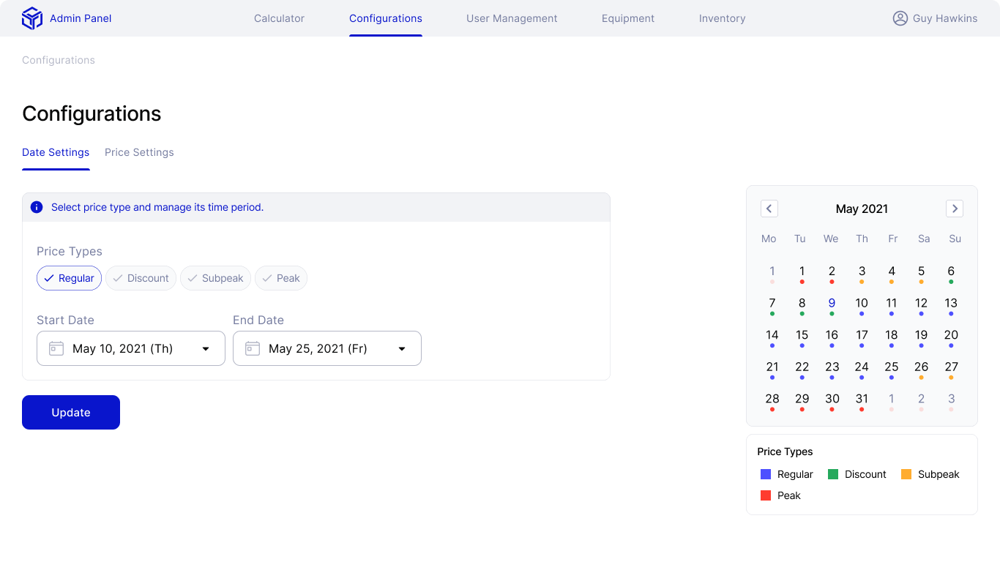

# Project name
Moving calculator

## Video Demo
https://youtu.be/zJ8bzH4tLT8

## Description
This project was developed for moving companies’ sale departments. It calculates estimated time required to complete the order and estimated price. Also, it calculates the number of movers and size of the truck required for the order. All calculations are based on the default inventory list or the list provided from the customer.

## Other features
- User management 
- Equipment management
- Crew management
- Create custom truck types
- Create price calendar
- Edit default inventory list

## Pictures
- Login and Registration  

| Login        | Registration         
| ------------- |:-------------:|
| | 

- Configurations

| Calendar       | Mover Price         
| ------------- |:-------------:|
|     | 

- Equipment

| Asset       | Asset Type         
| ------------- |:-------------:|
|     | 

- User Management and profile

| Use management       | Profile         
| ------------- |:-------------:|
|     | 

- Inventory

| Inventory       | Inventory Preset         
| ------------- |:-------------:|
|     | 

- Calculator

| Move Info       | Calculation Result          
| ------------- |:-------------:|
|     | 

## Download link
Not yet available